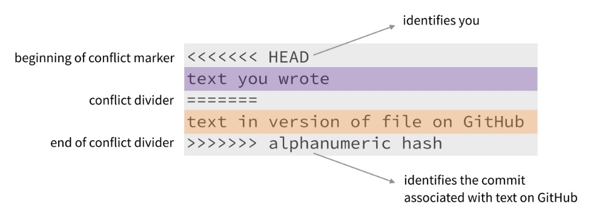

> *"I wish someone taught me **before** I was 30 repos deep and had GitHub dependabot sliding into my DMs three times a day."*  

Merge conflicts are an inevitable part of collaborative software development. It typically happens when different contributors make conflicting changes to the same codebase. While they might seem daunting at first, resolving merge conflicts via the command line is an essential skill for any developer. In this guide, we'll walk you through the process of resolving merge conflicts step by step, helping you regain the smooth flow of your development process.  

**Step 1: Update Your Local Repository**  
Before attempting to resolve a merge conflict, it's essential to make sure your local repository is up to date with the latest changes from the remote repository. Use the following commands:
```bash
git checkout main
git pull origin main
```

**Step 2: Create a New Branch**  
Before you start making any changes to resolve the conflict, it's a good practice to create a new branch. This keeps the main branch clean and allows you to work on the conflict resolution without affecting ongoing development. Use the command:

```bash
git checkout -b conflict-resolution
```
**Step 3: Merge the Conflicting Branch**  
Next, you'll want to merge the branch with the conflict into your current branch:

```bash
git merge <conflicting-branch>
```

**Step 4: Identify the Conflict**  
After attempting the merge, you'll receive a message indicating that there are conflicts. You can identify the conflicted files by using:

```bash
git status
```

The conflicted files will be marked as both "modified" and "unmerged."

**Step 5: Open the Conflicted Files**  
Open the conflicted files using a text editor or integrated development environment (IDE). In these files, you'll notice sections surrounded by  `\<\<\<\<\<\<\<` `=======` and `\>\>\>\>\>\>\>` which represent the conflicting changes from different branches.

**Step 6: Resolve the Conflict**  
Edit the conflicted sections to choose the appropriate code or combine changes from both branches. Remove the conflict markers (`\<\<\<\<\<\<\<` `=======` and `\>\>\>\>\>\>\>`) once you're satisfied with the resolution.  

VS Code includes a Merge Editor which makes things *a lot* easier.  
**Step 7: Stage the Changes**  
After resolving the conflicts, you need to stage the modified files:

```bash
git add <conflicted-file-1> <conflicted-file-2> ...
```

**Step 8: Commit the Merge Resolution**  
With the conflicts resolved and changes staged, commit the changes:

```bash
git commit -m "Resolve merge conflict in <conflicted-file>"
```

**Step 9: Push the Changes**  
Finally, push the resolved merge to your remote repository:

```bash
git push origin conflict-resolution
```

**Step 10: Create a Pull Request**  
If you're working in a collaborative environment, create a pull request from your conflict-resolution branch to the main branch. This allows the changes to be reviewed before merging into the main codebase.

##### ***Easy money.***
Resolving merge conflicts via the command line is an essential skill for developers working on collaborative projects. By following these steps, you can confidently navigate and resolve conflicts, ensuring the seamless progress of your development process. Remember that patience and clear communication with your team members are key to successfully resolving merge conflicts and maintaining a healthy codebase.